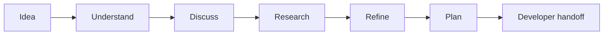
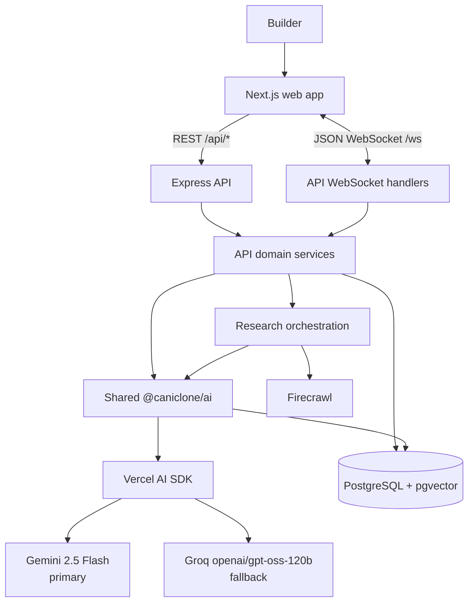
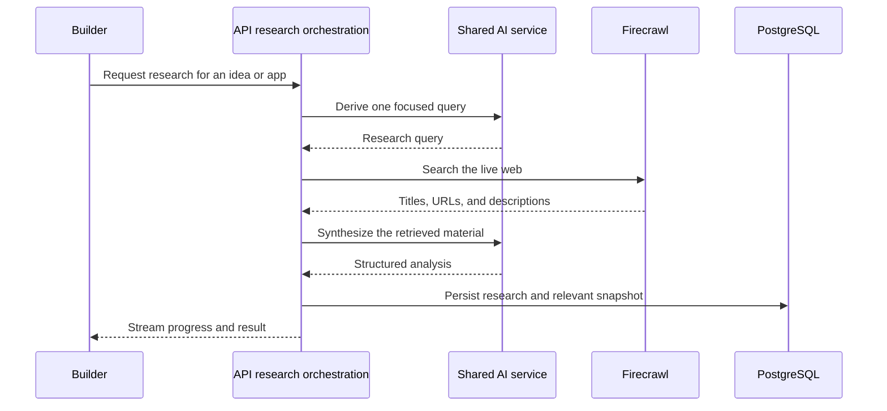

<div align="center">

<h1>CanIClone</h1>

<p><strong>From product uncertainty to a buildable plan.</strong></p>

<p>CanIClone is an AI-assisted development workspace for understanding products, developing ideas, researching the landscape, and turning context into a focused prompt or MVP specification.</p>

<p><a href="#the-caniclone-workflow">Explore the workflow</a> · <a href="docs/architecture.md">Architecture</a> · <a href="#quick-start">Get started</a></p>

<p>
  
  
  
</p>

</div>

## Contents

- [Why CanIClone?](#why-caniclone)
- [The CanIClone Workflow](#the-caniclone-workflow)
- [Product Flow](#product-flow)
- [AI Architecture](#ai-architecture)
- [Research Pipeline](#research-pipeline)
- [Features](#features)
- [Technology Stack](#technology-stack)
- [Repository Structure](#repository-structure)
- [Quick Start](#quick-start)
- [Development](#development)
- [Roadmap](#roadmap)
- [Documentation](#documentation)
- [Contributing](#contributing)
- [Security](#security)
- [License](#license)

## Why CanIClone?

A developer rarely starts with a complete specification. The open questions are usually concrete:

- Is the problem worth solving, and for whom?
- What products and workflows already exist?
- Which features are essential for a first version?
- What should the MVP contain?
- Which technical choices are defensible?
- What should be built first?

CanIClone keeps application facts, research evidence, AI discussion, prompts, and MVP artifacts in one workflow. It is designed to make uncertainty visible instead of replacing it with unsupported answers.

The repository currently contains two connected paths:

- an application directory for browsing, searching, comparing, and studying existing products; and
- an AI workspace for turning either an existing application or a new idea into more actionable context.

## The CanIClone Workflow



- **Idea** — capture a product problem or choose an application from the directory.
- **Understand** — turn broad context into a clearer problem, audience, constraints, and buildability assessment.
- **Discuss** — ask contextual questions in the Ideas or App Assistant workspace and receive streamed responses.
- **Research** — request live web research when Firecrawl is configured; unavailable research is reported honestly.
- **Refine** — turn the conversation and evidence into a clearer development prompt.
- **Plan** — generate an MVP specification that captures scope, structure, and implementation guidance.
- **Developer handoff** — copy or download the generated artifacts and continue implementation outside the current workspace. An autonomous code-building agent is not implemented here.

## Product Flow

The current Ideas path covers these implemented stages:

1. **Create an idea** — create and select anonymous idea workspaces through the Ideas API.
2. **Guided onboarding** — capture the problem, audience, constraints, and technology context; onboarding can resume locally.
3. **Initial analysis** — generate a title and a structured first analysis from the saved context.
4. **Contextual conversation** — ask questions and receive streamed assistant responses over the existing WebSocket protocol.
5. **Research** — derive a focused query, retrieve Firecrawl results, synthesize the evidence, and persist the result.
6. **Prompt generation** — produce a more focused development prompt from the idea and conversation.
7. **MVP generation** — produce a Markdown MVP specification from the available context and research.

The existing-application path is also implemented: an application detail page loads the stored `App` record and opens an App Assistant workspace for contextual chat, research, prompt refinement, and MVP generation.

The final development/build step is currently a developer handoff. The repository does not contain a code-execution or autonomous implementation agent.

## AI Architecture

The current request path uses the web application for interaction, the Express API for orchestration and persistence, and the shared AI package for provider calls and prompt-bound services.



### Provider strategy

- **Primary:** Gemini 2.5 Flash (`gemini-2.5-flash`).
- **Fallback:** Groq GPT-OSS 120B (`openai/gpt-oss-120b`).
- **Integration boundary:** the shared package uses the Vercel AI SDK with direct Google and Groq model adapters.
- **Streaming rule:** a stream can fall back only when the primary request fails before any text has been emitted.
- **Failure behavior:** missing configuration, provider errors, and empty responses remain explicit errors; the application does not fabricate a successful answer.

Both provider keys are checked by the AI capability endpoint. Provider calls happen on the server; the browser never receives provider credentials.

## Research Pipeline

Research is a separate, explicit path from ordinary chat:



For Ideas, the API implementation is `runResearch` in the Ideas research service. The App Assistant uses the same Firecrawl integration through `runAppResearch` in the App AI service.

The current research result contains:

- the generated query;
- source hits with a title, URL, and description; and
- an AI-synthesized analysis grounded in the retrieved material.

The result is persisted with the relevant idea or App AI conversation. If Firecrawl is unavailable, the UI receives an explicit unavailable state rather than invented sources.

## Features

| Feature | What exists now | Status |
| --- | --- | --- |
| Application directory | Browse applications, categories, alternatives, pricing, related apps, and detail reports. | Implemented |
| Search | Keyword and vector hybrid search over the existing application records. | Implemented |
| Market and opportunities | Market summaries, Trends API-backed views, and build-opportunity exploration. | Implemented |
| Ideas workspace | Anonymous idea creation, onboarding, persistence, selection, editing, and deletion. | Implemented |
| Contextual AI chat | Idea and application conversations use the relevant stored context. | Implemented |
| Streaming responses | Progress, token, completion, ready, and error events travel over `/ws`. | Implemented |
| Live research | Firecrawl-backed query generation, retrieval, synthesis, and persistence. | Implemented when configured |
| Prompt generation | Ideas and applications can produce refined development prompts. | Implemented |
| MVP generation | Ideas and applications can produce Markdown MVP specifications. | Implemented |
| Developer build execution | The workspace produces artifacts for a developer to use; it does not execute a build agent. | External handoff |

## Technology Stack

| Layer | Technology | Purpose |
| --- | --- | --- |
| Frontend | Next.js `16.3.5`, React `19`, TypeScript | App Router pages, feature UI, metadata, and browser state |
| API | Node.js, Express `5`, `ws` | REST endpoints, domain orchestration, and WebSocket transport |
| AI | Vercel AI SDK, Google and Groq adapters, Zod | Provider calls, prompts, structured analysis, and streaming |
| Research | Firecrawl | Live web retrieval for Ideas and App Assistant research |
| Data | PostgreSQL with `pgvector`, Prisma `7` | Application records, ideas, conversations, research, and MVP artifacts |
| Search | Hugging Face Transformers, MiniLM embeddings | Existing 384-dimension vector search inputs |
| Workspace | pnpm `10.33.0`, Turborepo | Workspace installation and build orchestration |
| UI | Tailwind CSS and the existing component set | Application presentation |

## Repository Structure

```text
CanIClone/
├── apps/
│   ├── web/                  # Next.js App Router frontend
│   └── api/                  # Express API and WebSocket server
├── packages/
│   ├── ai/                   # Prompts, schemas, and AI services
│   └── database/             # Prisma client, schema, migrations, and search
├── data/
│   └── apps/                 # Application catalog source records
├── scripts/                  # Import, embedding, and search utilities
├── docs/                     # Architecture and development guides
├── .github/                  # CI and community templates
├── .env.example              # Environment variable template
├── .gitignore
├── package.json
├── pnpm-lock.yaml
├── pnpm-workspace.yaml
├── turbo.json
└── README.md
```

The important boundaries are:

- `apps/web` — routes, feature UI, browser state, API clients, and WebSocket clients.
- `apps/api` — REST/WebSocket transport, ownership checks, research orchestration, and persistence calls.
- `packages/ai` — shared prompts, schemas, provider selection, and AI service functions.
- `packages/database` — Prisma schema/client, migrations, PostgreSQL access, and hybrid search.
- `data/apps` — catalog source data, not generated build output.
- `scripts` — import, embedding, and search utilities.

`LICENSE` is not currently present; a maintainer must select the intended license before the repository can be treated as licensed open source.

## Quick Start

### Prerequisites

- Node.js 22 or newer (the CI baseline).
- pnpm `10.33.0` through Corepack.
- PostgreSQL with the `vector` extension.
- Provider keys for the features you want to use.

### Clone and install

```bash
git clone https://github.com/rajesh-kayal-dev/CanIClone.git
cd CanIClone
corepack enable
pnpm install
```

### Configure the environment

Start with the tracked template:

```bash
cp .env.example .env
cp apps/web/.env.example apps/web/.env.local
```

Set the database values needed by the API and Prisma, and add the relevant `NEXT_PUBLIC_*` values to `apps/web/.env.local`. Never commit `.env` files or real provider keys.

The current variables are documented in [`.env.example`](.env.example):

- `PORT` — API and WebSocket port; defaults to `7000`.
- `NEXT_PUBLIC_API_URL` — web client API base URL.
- `NEXT_PUBLIC_APP_URL` — optional canonical URL for metadata.
- `DATABASE_URL` — runtime PostgreSQL connection.
- `DIRECT_URL` — direct connection for Prisma CLI and migrations.
- `SEARCH_DATABASE_URL` — optional direct search connection; falls back to `DIRECT_URL`.
- `GEMINI_API_KEY` and `GROQ_API_KEY` — server-side AI credentials.
- `FIRECRAWL_API_KEY` — optional live research credential.
- `TRENDS_API_KEY` — optional Trends API credential.
- `SERPAPI_API_KEY` — optional credential for the retained manual market-sync script.

### Generate the database client and run development

```bash
pnpm db:generate
pnpm dev
```

The web app runs on port `6001`; the API and WebSocket server use `PORT`, defaulting to `7000`. The root `predev` script also generates Prisma Client and builds the database and AI packages before starting development tasks.

For migration setup and troubleshooting, see [docs/development.md](docs/development.md).

## Development

The current root scripts are:

```bash
pnpm dev       # Start web and API development servers
pnpm build     # Build all workspaces
pnpm typecheck # Typecheck web and build the API
pnpm lint      # Run the web ESLint configuration
```

Additional existing database and utility commands include:

```bash
pnpm db:generate
pnpm --filter @caniclone/database db:validate
pnpm --filter @caniclone/database db:migrate
pnpm import:apps
pnpm embed:apps
pnpm test:hybrid
pnpm market:sync:trends
```

There is currently no root automated test script. The CI workflow runs the existing install, lint, typecheck, and build commands. See [docs/development.md](docs/development.md) for the full local workflow and troubleshooting notes.

## Roadmap

This is a phase-based view of the current repository, not a dated commitment.

| Phase | Focus | Status |
| --- | --- | --- |
| 01 | Application directory, search, market, and opportunities | Implemented |
| 02 | Ideas onboarding, persistence, and initial analysis | Implemented |
| 03 | App-level AI workspace and streaming | Implemented |
| 04 | Firecrawl research, prompt refinement, and MVP generation | Implemented |
| 05 | Validation and CI workflow | In progress; the workflow exists, but the current lockfile needs reconciliation for frozen installation |
| 06 | Production hardening and operational controls | Planned; not yet implemented as a complete release control set |
| 07 | Automated tests and release workflow | Not currently defined |
| 08 | Developer build workflow beyond artifact handoff | External handoff today; no autonomous build agent is implemented |

## Design Principles

- **Understand before building.** Start with the problem, audience, constraints, and evidence.
- **Research before assuming.** Keep live sources separate from model-generated interpretation.
- **Keep the developer in control.** Make provider failures, missing research, and unsupported claims visible.
- **Generate usable artifacts.** Produce prompts and MVP documents that can be carried into implementation.
- **Prefer inspectable systems.** Keep the web, API, shared AI, research, and persistence boundaries understandable.

## Documentation

- [Architecture](docs/architecture.md) — component boundaries, provider flow, research, persistence, and workspaces.
- [Development](docs/development.md) — setup, commands, database workflow, and troubleshooting.
- [Changelog](CHANGELOG.md) — current unreleased work.
- [Code of Conduct](CODE_OF_CONDUCT.md) — community expectations.
- [Security](SECURITY.md) — private vulnerability reporting guidance.

## Contributing

Contributions are welcome when they are focused, documented, and preserve the current provider, research, persistence, and WebSocket contracts. Read [CONTRIBUTING.md](CONTRIBUTING.md) before opening a pull request.

## Security

Please do not report vulnerabilities through public GitHub issues. Follow [SECURITY.md](SECURITY.md) for private reporting instructions and redaction guidance.

## License

No project license has been selected yet. The maintainer must choose an appropriate license and add a `LICENSE` file before presenting the repository as licensed open source.
