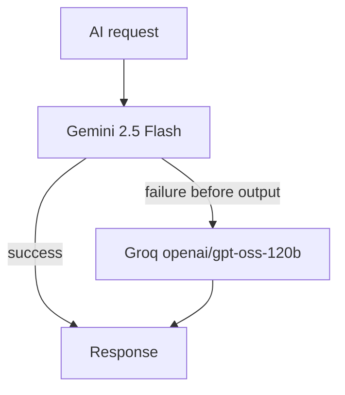

# CanIClone architecture

This document describes the architecture currently implemented in the repository. It is not a proposed redesign.

## System shape

```mermaid
flowchart LR
  Browser[Next.js web app] -->|REST /api/*| API[Express API]
  Browser <-->|JSON WebSocket /ws| API
  API --> AI[@caniclone/ai]
  API --> Research[ResearchService]
  Research --> Firecrawl[Firecrawl]
  Research --> AI
  API --> DB[(PostgreSQL + pgvector)]
  AI --> DB
  API --> WS[WebSocket protocol handlers]
  WS --> AI
  WS --> DB
```

## Frontend

The frontend is a Next.js App Router application under `apps/web`.

- `app/` contains public routes, layouts, loading states, and metadata.
- `features/ideas/` contains the Ideas workspace, onboarding, conversation UI, and Ideas WebSocket hook.
- `features/app-assistant/` contains the application-level assistant panel and its WebSocket hook.
- `features/ai-workspace/` contains shared AI output and prompt-action presentation.
- `features/apps/`, `features/search/`, `features/market/`, and `features/opportunities/` contain feature-specific UI.
- `lib/api/` contains REST clients and shared request helpers.
- `lib/anonymous-id.ts` creates and persists the browser's anonymous workspace identifier.

The web application reads `NEXT_PUBLIC_API_URL` for the API base URL and `NEXT_PUBLIC_APP_URL` for optional metadata configuration. Interactive Ideas and App Assistant features use the `/ws` endpoint.

## API

The API is an Express application under `apps/api/src`.

- `server.ts` registers the health endpoint and REST routers.
- `routes/` maps HTTP endpoints to domain controllers.
- `controllers/` contains request handling for apps, Ideas, market, opportunities, and AI analysis.
- `services/` contains persistence and orchestration logic grouped by domain.
- `integrations/firecrawl.ts` contains the server-side Firecrawl client and research availability errors.
- `ws/` contains the shared `/ws` transport, Ideas handler, App Assistant handler, and protocol types.
- `config/env.ts` loads the API environment files.

The API owns provider and research orchestration, anonymous ownership checks, Prisma writes, and client-safe error mapping. It does not expose provider keys to the browser.

## Shared AI layer

`packages/ai` is the shared AI boundary. It contains:

- provider selection and fallback in `src/models.ts`;
- app-analysis schemas and prompts;
- Ideas prompts and services;
- App workspace prompts and services;
- research-intent helpers;
- public exports consumed by the API.

The API calls the shared package for prompt construction, text generation, structured analysis, streaming, and research synthesis. The frontend does not call providers directly.

## AI providers and fallback

The current provider path is direct-provider only:



`withAIModelFallback` tries Gemini first and invokes Groq only after a non-abort failure. Streaming falls back only when no text has been emitted. Abort signals are preserved across both paths.

Provider configuration failures, rate limits, and empty responses are surfaced as errors. The application does not manufacture a successful result.

## WebSocket streaming

The API creates one HTTP server and attaches one WebSocket server at `/ws`. `ideas.socket.ts` owns the transport and dispatches App Assistant messages to `app-assistant.socket.ts`.

Ideas messages include chat, initial analysis, research, prompt, and MVP actions. App Assistant messages include app chat, research, prompt refinement, MVP, and cancellation actions. Progress, token, completion, ready, and error events are sent as JSON frames.

The frontend hooks in `apps/web/features/ideas/hooks/` and `apps/web/features/app-assistant/hooks/` construct the WebSocket URL from the API base URL and maintain the connection lifecycle. Protocol behavior is shared by both workspaces; the handlers remain domain-specific on the server.

## Research flow

The API's Ideas `ResearchService` and App Assistant research orchestration coordinate live research:

1. Load the owned idea or application context.
2. Ask the shared AI service for one focused research query.
3. Call the Firecrawl integration for web results.
4. Ask the shared AI service to synthesize the returned evidence.
5. Persist the research record and relevant snapshot/message.
6. Send progress and completion events over WebSocket.

Firecrawl availability is explicit. If research is not configured or fails, the API reports `ResearchUnavailableError`; callers may continue with an analysis-only response when appropriate, but no unverified result is presented as live research.

## Persistence

`packages/database` owns Prisma and PostgreSQL access.

- `prisma/schema.prisma` defines the application catalog, market data, AI analyses, Ideas, and App AI workspace models.
- `src/client.ts` creates the Prisma client with the PostgreSQL adapter.
- `src/search/hybrid-search.ts` performs keyword/vector search using the existing 384-dimension embeddings.
- `prisma.config.ts` points Prisma CLI operations at `DIRECT_URL`.
- Applied migrations remain under `prisma/migrations/` and are historical records.

The runtime uses `DATABASE_URL`. Hybrid search uses `SEARCH_DATABASE_URL` when supplied and otherwise falls back to `DIRECT_URL`.

## Ideas workflow

```mermaid
flowchart LR
  Draft[Idea draft] --> Onboarding[Guided onboarding]
  Onboarding --> Persist[Persist idea context]
  Persist --> Analysis[Initial analysis]
  Analysis --> Conversation[Discussion]
  Conversation --> Research[Optional Firecrawl research]
  Research --> Prompt[Prompt refinement]
  Prompt --> MVP[MVP generation]
  MVP --> Output[Copy or download output]
```



Ideas are scoped to a browser-generated anonymous UUID. The API checks that identifier on reads and writes. The UI can create, update, select, and delete ideas, and it displays the available AI/research capabilities.

## App workspace workflow

An application detail page loads the public `App` record and the anonymous viewer's `AppAIConversation`. The App Assistant can:

- discuss the application context;
- request live market/product research;
- generate and edit a refined prompt;
- accept a refined prompt into the application workspace;
- generate an MVP specification.

The public application record remains the factual directory source. Conversation, research, prompt refinements, and MVP documents are stored in the anonymous App AI workspace.

## Package and application boundaries

- `apps/web`: presentation, routes, browser state, API clients, and WebSocket clients.
- `apps/api`: HTTP/WebSocket transport, domain orchestration, ownership, research, and persistence calls.
- `packages/ai`: provider-neutral AI contracts, prompts, schemas, and provider calls.
- `packages/database`: Prisma schema/client, migrations, database access, and hybrid search.
- `data/apps`: catalog source records.
- `scripts`: import, embedding generation, and hybrid-search utilities.

The API and shared AI/database packages are workspace packages linked through `pnpm`; the web app communicates with the API over HTTP and WebSocket rather than importing server packages into the browser.
